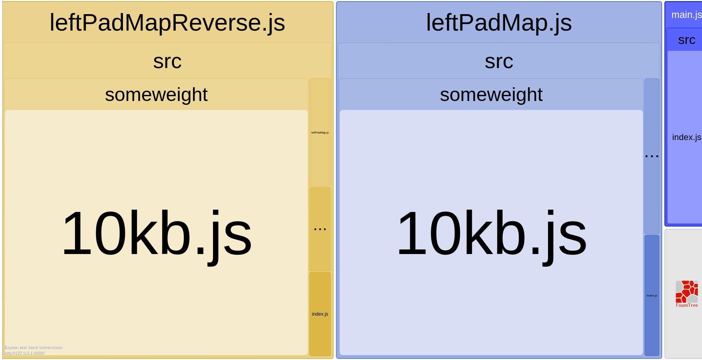

# Example of webpack configuration for modular a modular library

In a library that produces multiple bundles. You may want to
minimize the size of the generated files if some utilities
are reused between multiple bundles.
Unfortunately, you cannot use
[CommonsChunkPlugin](https://webpack.js.org/plugins/commons-chunk-plugin/)
with `target: 'node'` in the webpack configuration.

Here is a solution preventing the duplication of code
in the bundles. It involves importing the library from itself.

In this example, `mypackagename` is the name of the library which
produces 3 bundles:
* main.js
* leftPadMap.js (depends on main.js)
* leftPadMapReverse.js (depends on main.js and leftPadMap.js)

### Before
In this example, all imports of mypackagename elements
are made with relative paths.
```javascript
import { leftPadMap } from './leftPadMap';
```
Webpack outputs:
```
// Library
               Asset     Size   Chunks             Chunk Names
leftPadMapReverse.js  11.7 kB  0, 1, 2  [emitted]  leftPadMapReverse
       leftPadMap.js  11.5 kB     1, 2  [emitted]  leftPadMap
             main.js  1.04 kB        2  [emitted]  main

// Consumer of: leftPadMap + leftPadMapReverse
  Asset     Size  Chunks             Chunk Names
test.js  99.3 kB       0  [emitted]  test

// The bundle analyzer shows that mypackagename is using **25KB** in the consumer.
```

### After
In this example, imports of mypackagename elements
are made with relative paths.
```javascript
// You'd better hide that import to Eslint,
// if you don't want it to shout at you :)
// eslint-disable-next-line
import { leftPadMap } from 'mypackagename/dist/leftPadMap';
```
For this to work, you need to tell webpack to consider 'mypackagename'
as external. For example like this:
```javascript
externals: [
  nodeExternals(), // the usual node_modules
  /mypackagename$/,
  /mypackagename\/dist/
]
```
Webpack outputs:
```
// Library
               Asset     Size  Chunks             Chunk Names
       leftPadMap.js  11.3 kB       0  [emitted]  leftPadMap
leftPadMapReverse.js  1.27 kB       1  [emitted]  leftPadMapReverse
             main.js  1.04 kB       2  [emitted]  main

// Consumer of: leftPadMap + leftPadMapReverse
  Asset     Size  Chunks             Chunk Names
test.js  90.9 kB       0  [emitted]  test

// The bundle analyzer shows that mypackagename is using **16KB** in the consumer.
```

As expected, the consumer's bundle is reduced by around **10KB**,
since the duplication of the ~10KB file is removed.


##### Notes
* In this example. The consumer (test/) has some
  preinstall-postinstall steps, because the module
  resolution does not work well with packages imported
  with the local paths. But those steps are not needed
  if the library is imported through npm repository for
example.
* If you have another webpack configuration for
  your development mode (eg, with live updates),
  You can use aliases to resolve your library in your
  sources. See:
  [partial webpack development configuration example](library/webpack.config.dev.js)
* In the example, the gain seems marginal.
  But that is because the third party modules (65KB)
  are much heavier than the application.